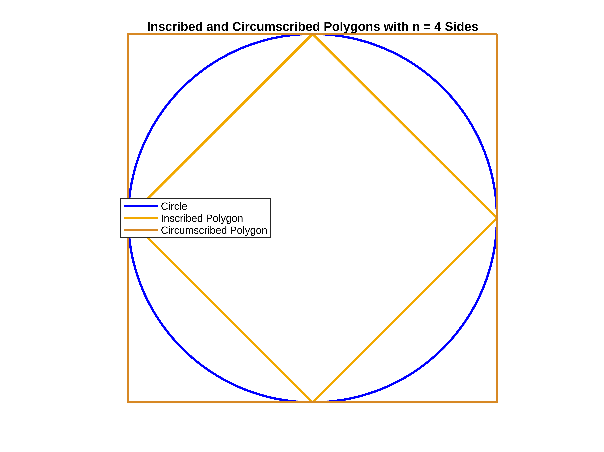

# Pi Day [](https://matlab.mathworks.com/open/github/v1?repo=yanndebray/pi&file=piDayBlog.mlx&focus=true)
<a name="beginToc"></a>

## Table of Contents
&emsp;&emsp;[What is Pi?](#what-is-pi-)
 
&emsp;&emsp;[Symbolic vs Numeric](#symbolic-vs-numeric)
 
&emsp;&emsp;[More resources](#more-resources)
 
&emsp;&emsp;[Utilities](#utilities)
 
<a name="endToc"></a>

## What is Pi?

Around 250 BC, Archimedes demonstrated that the ratio of a circle’s circumference to its diameter is constant. This is what is now known as the number π. 

```matlab
drawCircleDiagram
```


*How can you approximate it?*


Numeric computation, unlike symbolic computation, is about approximation with limited precision. 


A first approximation of the number π is slightly more than 3 and definitely less than 4.


When you wrap a string around a circle, its length is slightly over three times the diameter. 


This is brilliantly illustrated in last year’s post from Mike: [Pi day: Using AI, GPUs and Quantum computing to compute pi](https://blogs.mathworks.com/matlab/2024/03/14/pi-day-using-ai-gpus-and-quantum-computing-to-compute-pi/).


*A little over 3 ...*


*... But not quite 4*

```matlab
% Create a new figure
figure;
axis equal;                       % Equal scaling on both axes
axis off;                         % Hide the axes

% Define the square's position and size (e.g., a 10-by-10 square)
squarePos = [0, 0, 10, 10];

% Draw the square with orange color (using an RGB triplet)
rectangle('Position', squarePos, 'EdgeColor', [1, 0.65, 0], 'LineWidth', 2);
hold on;

% Draw the circle inside the square with blue color
rectangle('Position', squarePos, 'Curvature', [1, 1], 'EdgeColor', 'blue', 'LineWidth', 2);

% Ensure equal scaling on both axes so the circle remains circular
axis equal;
hold off;
```


*Archimedes method*


This turns out to be the approach that Archimedes took[\[AD1\]](about:blank<#_msocom_1%3E) , by generalizing beyond a square to a polygon. You can view a circle as a polygon with an infinite number of sides: 

1.  Start with a known polygon (e.g., a hexagon) whose perimeter can be easily computed.
2. Repeatedly **double the number of sides** to create larger inscribed and smaller circumscribed polygons.
3. Calculate the perimeters of both polygons. As the number of sides grows, these perimeters “squeeze” π from below and above.
```matlab
% Set the number of sides for the polygons (try different values, e.g., 4, 6, 10, etc.)
n = 4; %sides
archi(n)
```



## Symbolic vs Numeric

In modern terms (and in MATLAB), we can implement this by iterating until the perimeters converge to a stable value. Once converged, we have a numeric approximation of π. 

```matlab
digits(5);
a = vpa(2*sqrt(2),d);
b = vpa(4,d);
c= (a+b)/2;
for k=3:d
        b = b * a / c ;
        a = sqrt (b * a ) ;
        c = ( a + b ) / 2;
end
P=(2*a+b)/3
```
P = 
 $\displaystyle 3.1416$
 

If we use MATLAB’s variable precision arithmetic ([`vpa `function](https://www.mathworks.com/help/symbolic/sym.vpa.html)), we can push this to many more digits than Archimedes ever could.

```matlab
precision =42;
vpa(sym(pi),precision)
```
ans = 
 $\displaystyle 3.14159265358979323846264338327950288419717$
 


With symbolic results, you get the following output options you can choose from:


## More resources

More on archimedes method

```matlab
% Set initial parameters
n = 6;          % starting with a hexagon (6 sides)
maxSides = 96;  % maximum number of sides
sides = [];     % vector to store the number of sides
lowerBounds = []; % vector for lower bound approximations (inscribed)
upperBounds = []; % vector for upper bound approximations (circumscribed)

fprintf('Number of sides\tLower Bound (inscribed)\tUpper Bound (circumscribed)\n');
```

```matlabTextOutput
Number of sides    Lower Bound (inscribed)    Upper Bound (circumscribed)
```

```matlab
while n <= maxSides
    % Calculate the lower and upper bounds for a circle of radius 1.
    % (Dividing the perimeter by the diameter 2 gives the approximation for pi.)
    lower_bound = n * sin(pi/n);    % inscribed polygon bound
    upper_bound = n * tan(pi/n);      % circumscribed polygon bound
    
    % Display the results in the command window
    fprintf('%d\t\t\t%1.6f\t\t\t%1.6f\n', n, lower_bound, upper_bound);
    
    % Save the values for later plotting
    sides = [sides, n];
    lowerBounds = [lowerBounds, lower_bound];
    upperBounds = [upperBounds, upper_bound];
    
    % Double the number of sides for the next iteration
    n = n * 2;
end
```

```matlabTextOutput
6            3.000000            3.464102
12            3.105829            3.215390
24            3.132629            3.159660
48            3.139350            3.146086
96            3.141032            3.142715
```

```matlab

% Display the true value of pi for comparison
fprintf('\nTrue value of pi: %1.6f\n', pi);
```

```matlabTextOutput
True value of pi: 3.141593
```

```matlab

% Plot the approximations versus the number of sides
figure;
plot(sides, lowerBounds, 'b-o', 'LineWidth',1.5);
hold on;
plot(sides, upperBounds, 'r-o', 'LineWidth',1.5);
yline(pi, 'k--', 'LineWidth',1.5);
xlabel('Number of Sides');
ylabel('Approximation of \pi');
title('Archimedes'' Approximation of \pi Using Polygons');
legend('Lower Bound (Inscribed)', 'Upper Bound (Circumscribed)', 'True \pi','Location','best');
grid on;
```


```matlab
help vpa
```

```matlabTextOutput
 vpa - Variable-precision arithmetic (arbitrary-precision arithmetic)
    This MATLAB function uses variable-precision arithmetic
    (arbitrary-precision floating-point numbers) to evaluate each element of
    the symbolic input x to at least d significant digits, where d is the
    value of the digits function.

    Syntax
      xVpa = vpa(x)
      xVpa = vpa(x,d)

    Input Arguments
      x - Input to evaluate
        number | vector | matrix | multidimensional array |
        symbolic number | symbolic vector | symbolic matrix |
        symbolic multidimensional array | symbolic expression |
        symbolic function | symbolic character vector |
        symbolic matrix variable
      d - Number of significant digits
        positive integer scalar

    Output Arguments
      xVpa - Variable-precision output
        symbolic number | symbolic vector | symbolic matrix |
        symbolic multidimensional array | symbolic expression |
        symbolic function

    Examples
      Evaluate Symbolic Inputs with Variable-Precision Arithmetic
      Change Precision Used by vpa
      Numerically Approximate Symbolic Results
      vpa Uses Guard Digits to Maintain Precision
      Avoid Hidden Round-Off Errors
      vpa Restores Precision of Common Double-Precision Inputs
      Evaluate Symbolic Matrix Variable with Variable-Precision Arithmetic

    See also digits, double, root, vpaintegral

    Introduced in Symbolic Math Toolbox before R2006a
    Documentation for vpa
    Other uses of vpa
```

## Utilities
```matlab
% Archimedes' Polygons: Inscribed and Circumscribed in a Circle
function archi(n)  
    % Define the circle (unit circle centered at the origin)
    r = 1;
    theta = linspace(0, 2*pi, 1000);
    x_circle = r * cos(theta);
    y_circle = r * sin(theta);
    
    % Create a new figure and plot the circle
    figure;
    plot(x_circle, y_circle, 'b-', 'LineWidth', 2);
    hold on;
    
    % Plot the inscribed polygon
    theta_ins = linspace(0, 2*pi, n+1);  % +1 ensures the polygon is closed
    x_ins = r * cos(theta_ins);
    y_ins = r * sin(theta_ins);
    plot(x_ins, y_ins, 'Color', [242/255, 169/255, 0], 'LineWidth', 2);  % blue line for inscribed polygon
    
    % Compute and plot the circumscribed polygon:
    % The circumradius for a circumscribed polygon is R = r / cos(pi/n)
    R = r / cos(pi/n);
    % Offset the angles by pi/n so that the sides are tangent to the circle
    theta_circ = linspace(pi/n, 2*pi + pi/n, n+1);
    x_circ = R * cos(theta_circ);
    y_circ = R * sin(theta_circ);
    plot(x_circ, y_circ, 'Color',[215/255, 136/255, 36/255], 'LineWidth', 2);  % orange line for circumscribed polygon
    
    % Annotate the plot
    axis equal;
    axis off;
    xlabel('x');
    ylabel('y');
    title(['Inscribed (blue) and Circumscribed (orange) Polygons with n = ' num2str(n) ' Sides']);
    legend('Circle', 'Inscribed Polygon', 'Circumscribed Polygon','Location','best');
    grid on;
    hold off;
end
```

```matlab
function drawCircleDiagram()
    % Create a figure without axis
    hold on;
    axis equal;                       % Equal scaling on both axes
    axis off;                         % Hide the axes
    
    % Define circle radius and angle resolution
    r = 1.0;
    theta = linspace(0, 2*pi, 300);
    
    % Compute x,y for  (white) and outer (blue) circles
    x = r * cos(theta);
    y = r * sin(theta);
    
    % Plot the circle in orange
    plot(x, y, 'Color', [1.0 0.65 0.0], 'LineWidth', 2);
    
    % Plot the  circle in blue
    plot(x, y, 'Color', 'blue', 'LineWidth', 2);
    
    % Draw the diameter in orange using an RGB triplet
    plot([-r, r], [0, 0], 'Color', [1.0 0.65 0.0], 'LineWidth', 2);
    
    % Label the diameter D near the center (orange)
    text(0, 0.1, 'D', ...
        'Color', [1.0 0.65 0.0], 'FontSize', 16, 'FontWeight','bold', ...
        'HorizontalAlignment', 'center');
    
    % Label the perimeter (P) near the top of the circle (blue)
    text(0, r + 0.1, 'P', ...
        'Color', 'blue', 'FontSize', 16, 'FontWeight','bold', ...
        'HorizontalAlignment', 'center');
    
    % Add the equations on the right side (black text)
    text(1.4, 0.2, 'P = \pi \times D', ...
        'Color', 'black', 'FontSize', 14, 'FontWeight','bold');
    % text(1.4, 0.4, '\pi = P / D', ...
    %     'Color', 'black', 'FontSize', 14, 'FontWeight','bold');
    
    % Adjust limits so everything is visible
    xlim([-1.5 2.2]);
    ylim([-1.2 1.2]);
    
    hold off;
end
```
